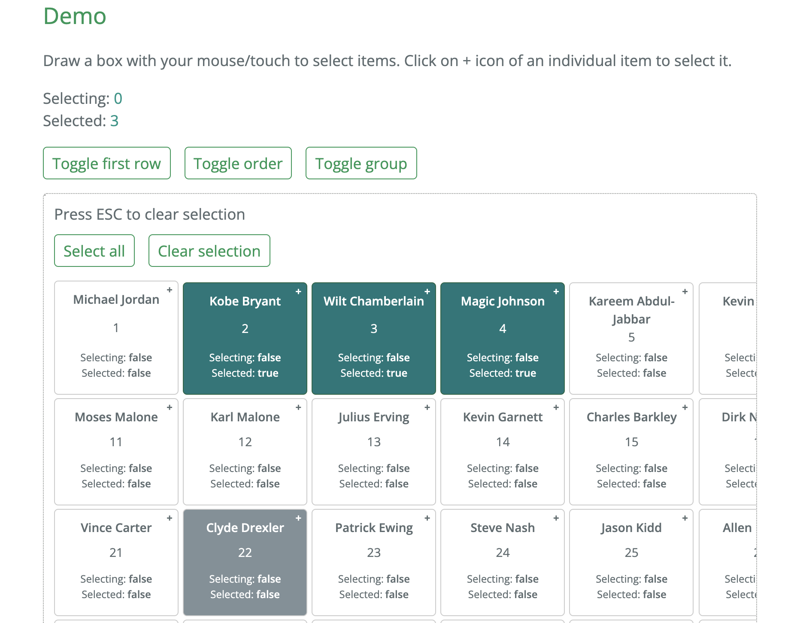

# react-selectable-fast
React 拖动鼠标选择区块。

## Demo
Draw a box with your mouse/touch to select items. Click on + icon of an individual item to select it.    

[Demo](https://react-selectable-fast.vercel.app/#demo)
  

## 参考
[react-selectable-fast](https://github.com/valerybugakov/react-selectable-fast)  
[Homepage](https://react-selectable-fast.vercel.app)