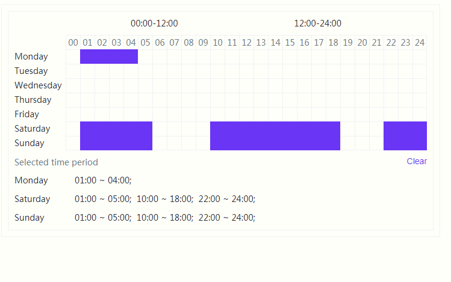

# time-period-selector
拖拽时间选择器，用来选择一周内 n 个时间段。

## 用法

## 参考
[[React] 基于react 拖拽时间选择器](https://www.cnblogs.com/cong-bao/p/13140145.html)  
[time-period-selector](https://github.com/congbao1991/time-period-selector)
